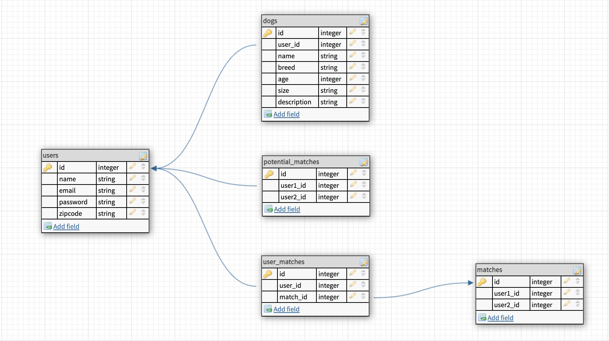

# WingPup

## Overview

---
WingPup is place for people to find the perfect wingman for their dog! We understand that like humans, dogs dont always like the same things and sometimes, they just dont get along. Whether its playing rough, fetching sticks, or just lounging in the grass, WingPup will help you find other dogs in your area that DO like the same activites as yours! 

## User Stories

---
1. When I load thesite, I'm on a home page that has a welcome message.
1. When not logged in, I see links to Home, Signup & Login only. If I were to visit any of these routes manually while logged in, I would get redirected to the home page.
1. When logged in, I see links to Home, Profile, Matches. If I were to visit any of these routes manually while logged out, I would get redirected to the home page.
1. When logged in, the home page has a users profile picture and a description. I have the option to click the photo,swipe left or right.
1. If I click the photo, a there is a popup of the users profile where I can see all of their pictures and info.
1. If I swipe left, I am shown a new user. If I swipe right and the user has also swipped right on my profile, I get a pop-up message telling me so with the option to continue swiping or to view matches.

## Wireframes & ERD

---

## Routes Inventory

---

| Route       | Description |
| ----------- | ----------- |
| POST /users/signup | add a new user to users table |
| POST /users/login  | send info to back to check password and send user info to the front |
| GET /users/verify | get user info to display profile | 

## MVP Checklist

---

1. Python backend with encoding and hashing
1. Create models and associations to make matches work correctly.
1. Add ability to upload pictures

## Stretch Goals

---

1. Messaging
1. React Native
